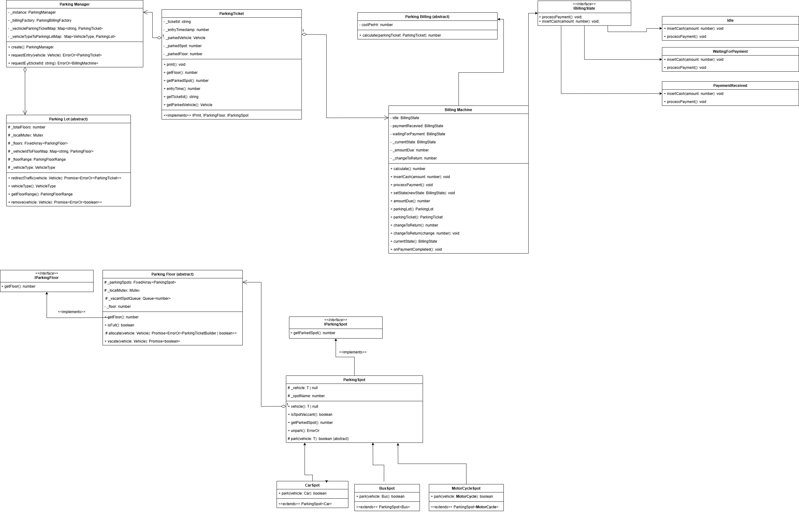

# Parking Lot Management System - Low-Level Design (LLD)

## Table of Contents

* [Introduction](#introduction)
* [Requirements](#requirements)
* [System Design](#system-design)
* [Class Diagrams](#class-diagrams)
* [Design Patterns Used](#design-patterns-used)
* [How to Run](#how-to-run)
* [Example Usage](#example-usage)

---

## Introduction

This ParkingLot system is designed to manage parking operations, including vehicle entry and exit, real-time parking availability updates, and parking fee calculations. The system automatically assigns parking spots based on vehicle types (motorcycle, car, bus), handles check-ins and check-outs, and calculates the parking fee based on the duration of the stay.

The system allows for:
- **Parking Spot Allocation**: Allocate parking spots based on vehicle type (MotorCycle, Car, Bus).
- **Check-in/Check-out System**: Vehicles can check in and check out with a ticket.
- **Billing System**: Calculates the parking fee based on the vehicle type and time parked.
- **Real-Time Availability Updates**: Tracks and updates parking spot availability.

---

## Requirements

### Functional Requirements

1. **Parking Spot Allocation**
   - Parking spots are divided by vehicle type (MotorCycle, Car, Bus).
   - Each parking floor has a predefined number of spots.
   - When a vehicle checks in, an available spot is assigned to it.
   - When a vehicle checks out, the spot is marked as available again.

2. **Check-In/Check-Out**
   - A vehicle can check into the parking lot if there is an available spot.
   - A parking ticket is issued upon check-in, which contains details like the vehicle's information, parking spot, and parking floor.
   - A vehicle can check out, and the parking spot becomes vacant.

3. **Parking Fee Calculation**
   - Fees are calculated based on the vehicle type and the duration the vehicle was parked.
   - Different vehicle types have different hourly rates (e.g., motorcycles, cars, buses).

4. **Real-Time Availability Update**
   - Real-time tracking of available spots on each floor.
   - Parking spots can be checked for availability at any time.

### Non-Functional Requirements

- **Scalability**: The system should handle the allocation of parking spots for various types of vehicles efficiently.
- **Concurrency**: The system should support concurrent check-ins/check-outs without conflicts.
- **Extensibility**: The system should be easily extensible to support additional vehicle types, parking floors, or billing strategies.

---

## System Design

### Assumptions
- **Multi-Storey Parking Structure**: The design assumes that the parking lot is a multi-storey building, with each vehicle type having a collection of floors dedicated to it. 
  - **Motorcycles**: Lower floors.
  - **Cars**: Middle floors.
  - **Buses**: Upper floors.
- Each floor consists of multiple parking spots, and these floors are grouped based on the vehicle type.

### Overview

The system consists of several key components:

1. **ParkingLot**
   - Represents the entire parking lot and manages multiple floors. Each floor has spots for different vehicle types (MotorCycle, Car, Bus).

2. **ParkingFloor**
   - A floor of the parking lot dedicated to a specific vehicle type. Each floor has a set of parking spots for the corresponding vehicle.

3. **ParkingSpot**
   - Represents a parking spot in the parking lot. Each spot is associated with a specific vehicle type and can be occupied or vacant.

4. **Vehicle**
   - Base class for different vehicle types. Includes information like vehicle name, model, plate number, and vehicle type.

5. **Billing**
   - Each vehicle type has its own billing calculation based on time parked.
   
6. **ParkingTicket**
   - Contains details about the parking session (ticket ID, vehicle, parking spot, entry time, etc.).

7. **Payment System (State Pattern)**
   - Manages the payment process through a state machine, transitioning between states like "Idle", "Waiting for Payment", and "Payment Received".

### Key Interactions

- When a vehicle enters the parking lot, a **ParkingFloor** is selected based on the vehicle type.
- The **ParkingFloor** allocates a **ParkingSpot** using the **Mutex** to ensure thread-safety during allocation.
- A **ParkingTicket** is issued, capturing the vehicle's details, spot number, and entry time.
- When the vehicle checks out, the **ParkingSpot** is marked vacant.
- The **Billing** system calculates the fee based on the vehicle type and parking duration.
- The **State Pattern** is used to manage the payment process, ensuring the system transitions between payment stages correctly.

### How We Handle: Spot Allocation & Concurrency

#### **Algorithm for Spot Allocation**

To efficiently assign parking spots to incoming vehicles, we maintain a **vacant index queue** for each parking floor. Here's how it works:

* **Vacant Index Queue**: A queue tracks the indices of available parking spots (`vacantIndexQueue`).
* **Spot Assignment**: When a vehicle checks in, the system dequeues an index from the queue and assigns that spot to the vehicle.
* **Spot Release**: Upon vehicle exit, the freed spot's index is re-enqueued to maintain availability.
* **Efficiency**: This approach ensures `O(1)` time complexity for both spot assignment and release, keeping the system performant even under high load.

#### **Concurrency Handling**

To handle simultaneous check-ins and check-outs, especially in async event-driven environment:

* It uses **`@d3vtool/mutex`** library to ensure safe mutation of in-memory data structures (e.g., queues and spot states, floors).
* This prevents **race conditions** and ensures **data integrity** when multiple vehicles interact with the same parking floor or spot concurrently.

---

## Class Diagrams

Below is an overview of the key classes and their relationships:


---

## Design Patterns Used

### 1. **Factory Pattern**
   - Used to create instances of different vehicle types (`MotorCycle`, `Car`, `Bus`) through the `VehicleFactory` class.

### 2. **Builder Pattern**
   - The `ParkingTicketBuilder` class is used to construct a **ParkingTicket** with various attributes like vehicle type, spot number, etc.

### 3. **State Pattern**
   - The **BillingMachine** uses the **State Pattern** to manage different stages of the payment process (e.g., Idle, Waiting for Payment, Payment Received).
   
---

## How to Run

### 1. Clone the Repository

```bash
git clone https://github.com/ks6201/parking-lot
cd parking-lot
```

### 2. Install Dependencies

Make sure you have **Bun** installed. Then, install the required dependencies:

```bash
bun install
```

### 3. Run the Application

```bash
bun app.ts
```

### 4. Test the Application

```bash
bun run test
```

---

## Example Usage

Here’s an example of how you might use the system to allocate parking spots and process payments:

```typescript

async function handleBilling(machine: BillingMachine) {
    while (machine.paymentIncomplete()) {
      machine.insertCash(10);
    }
    machine.processPayment();
}

const manager = ParkingManager.create();

const car = new Car("Tesla", "Model S", "CAR123");

const carTicketResult = await manager.requestEntry(car);

const carExitResult = await manager.requestExit(carTicketResult.value()!.getTicketId());

if (carExitResult.isError()) throw new Error(carExitResult.error()!);
await handleBilling(carExitResult.value()!);
console.log("Car exited successfully!");
```